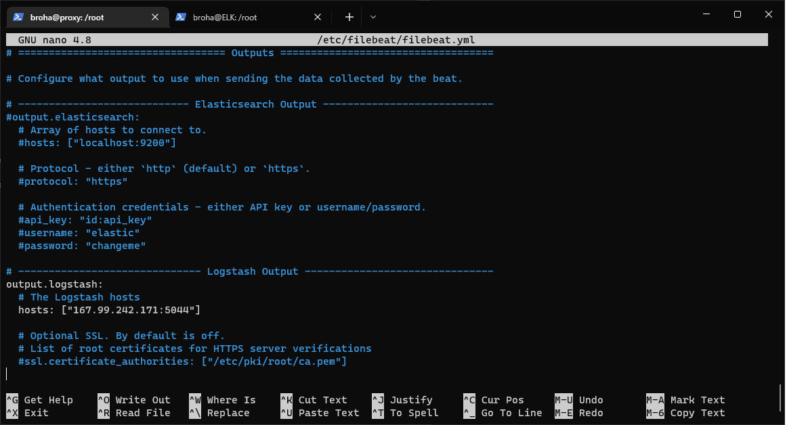
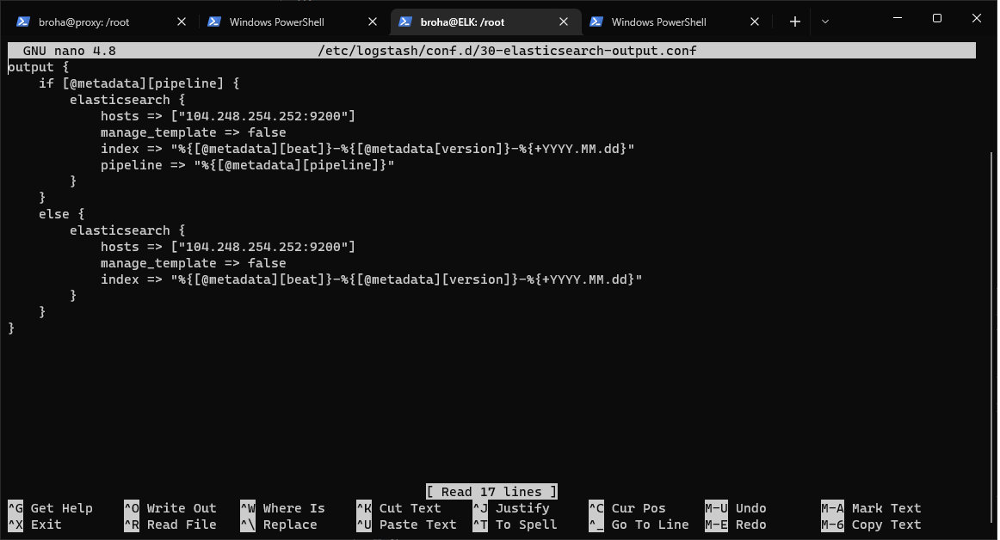

# Лабораторная работа 2
Создаём 2 виртуальные машины на DO

Одна нужна для прокси, вторая для ELK.

Заходим на вм proxy

Производим стандартные sudo apt update/upgrade

# Установка squid

sudo apt install squid

# Настройка squid

заходим в конфиг:
sudo nano /etc/squid/squid.conf

Переходим до строчки include /etc/squid/conf.d/*
и дописываем следующую информацию:

Сохраняем файл, выходим

# Установка Apache

sudo apt install apache2-utils
sudo htpasswd -c /etc/squid/passwords *username*

и запускаем сервер

sudo systemctl start squid
sudo systemctl enable squid
sudo ufw allow 3128 (порт squid)

Проверка Proxy:

# Установка elasticsearch

Переходим на вм ELK
Проводим стандартные sudo apt update/upgrade

Устанавливаем java

sudo apt install default-jre
sudo apt install default-jdk

Переходим к самому elasticsearch

Для начала получаем ключ elasticsearch gpg

curl -fsSL https://artifacts.elastic.co/GPG-KEY-elasticsearch | sudo apt-key add -

и выполняем следующую команду:

echo "deb https://artifacts.elastic.co/packages/7.x/apt stable main" | sudo tee -a /etc/apt/sources.list.d/elastic-7.x.list

Наконец, устанавливаем elasticsearch

sudo apt install elasticsearch

# Настройка Elasticsearch

Переходим в конфиг файл:

sudo nano /etc/elasticsearch/elasticsearch.yml

Вписываем следующие строки:

Создаём пользователей:

sudo -u root /usr/share/elasticsearch/bin/elasticsearch-setup-passwords auto

Сохраняем полученные данные (потом понадобятся)

Запускаем:

sudo systemctl start elasticsearch
sudo systemctl enable elasticsearch

# Уустановка Kibana

sudo apt install kibana

# Настройка Kibana

Переходим в конфиг файл:

sudo nano /etc/kibana/kibana.yml

раскоменчиваем эти строки 

Добавляем пароль (полученный ранее)

sudo -u root /usr/share/kibana/bin/kibana-keystore create
sudo -u root /usr/share/kibana/bin/kibana-keystore add elasticsearch.password

И запускаем 

sudo systemctl start kibana
sudo systemctl enable kibana

# Установка Logstash

sudo apt install logstash

# Настройка Logstash

Переходим в конфиг файл:

sudo nano /etc/logstash/conf.d/02-beats-input.conf

Вписываем следующее:

в следующий кофиг файл:

sudo nano /etc/logstash/conf.d/30-elasticsearch-output.conf

Вписываем следующее:

Проверяем, что всё работает:

sudo -u logstash /usr/share/logstash/bin/logstash --path.settings /etc/logstash -t

В выводе должно быть OK

Запускаем:

sudo systemctl start logstash
sudo systemctl enable logstash

