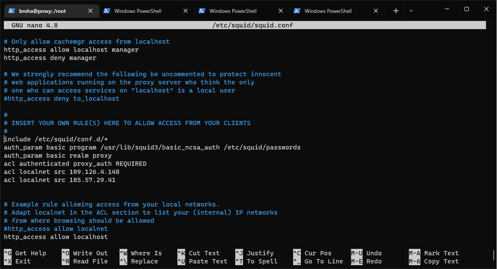
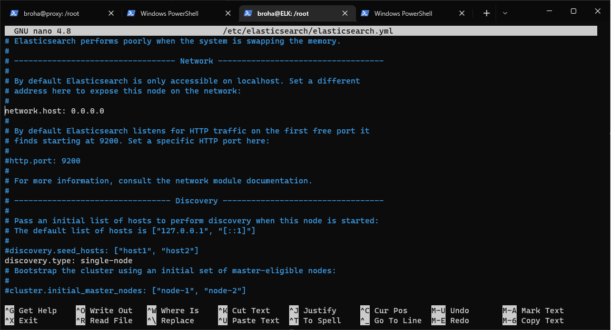
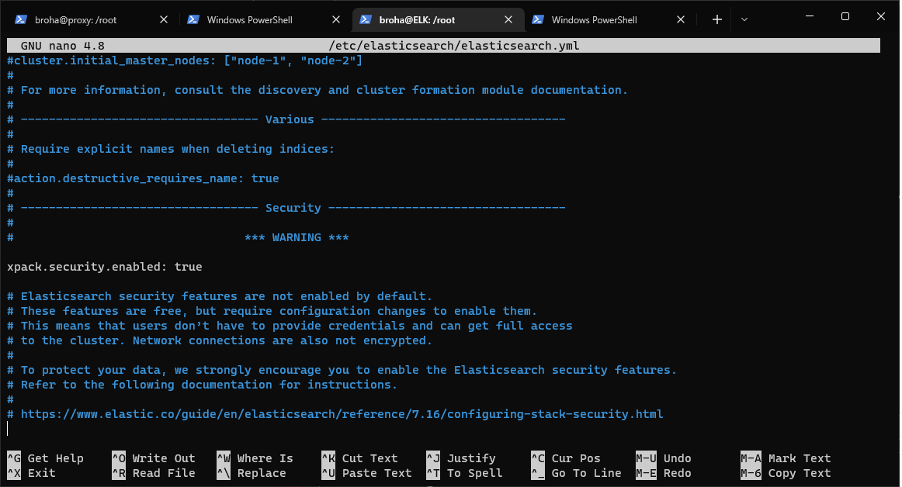
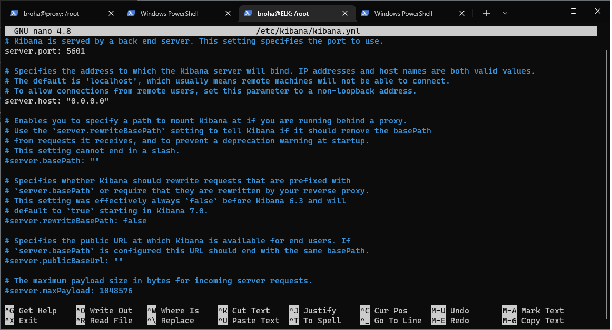
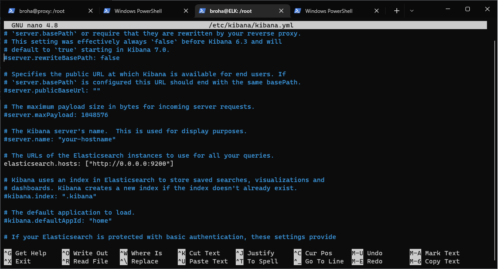

# Лабораторная работа 2
Создаём 2 виртуальные машины на DO

Одна нужна для прокси, вторая для ELK.

Заходим на вм proxy

Производим стандартные sudo apt update/upgrade

# Установка squid

sudo apt install squid

# Настройка squid

заходим в конфиг:
sudo nano /etc/squid/squid.conf

Переходим до строчки include /etc/squid/conf.d/*

и дописываем следующую информацию:



Сохраняем файл, выходим

# Установка Apache

sudo apt install apache2-utils

sudo htpasswd -c /etc/squid/passwords *username*

и запускаем сервер

sudo systemctl start squid

sudo systemctl enable squid

sudo ufw allow 3128 (порт squid)

Проверка Proxy:


# Установка elasticsearch

Переходим на вм ELK

Проводим стандартные sudo apt update/upgrade

Устанавливаем java

sudo apt install default-jre

sudo apt install default-jdk

Переходим к самому elasticsearch

Для начала получаем ключ elasticsearch gpg

curl -fsSL https://artifacts.elastic.co/GPG-KEY-elasticsearch | sudo apt-key add -

и выполняем следующую команду:

echo "deb https://artifacts.elastic.co/packages/7.x/apt stable main" | sudo tee -a /etc/apt/sources.list.d/elastic-7.x.list

Наконец, устанавливаем elasticsearch

sudo apt install elasticsearch

# Настройка Elasticsearch

Переходим в конфиг файл:

sudo nano /etc/elasticsearch/elasticsearch.yml

Вписываем следующие строки:





Создаём пользователей:

sudo -u root /usr/share/elasticsearch/bin/elasticsearch-setup-passwords auto

Сохраняем полученные данные (потом понадобятся)

Запускаем:

sudo systemctl start elasticsearch

sudo systemctl enable elasticsearch

# Установка Kibana

sudo apt install kibana

# Настройка Kibana

Переходим в конфиг файл:

sudo nano /etc/kibana/kibana.yml

раскоменчиваем эти строки 





Добавляем пароль (полученный ранее)

sudo -u root /usr/share/kibana/bin/kibana-keystore create

sudo -u root /usr/share/kibana/bin/kibana-keystore add elasticsearch.password

И запускаем 

sudo systemctl start kibana

sudo systemctl enable kibana

# Установка Logstash

sudo apt install logstash

# Настройка Logstash

Переходим в конфиг файл:

sudo nano /etc/logstash/conf.d/logstash.conf

Вписываем следующее:
``` properties
input {
    beats {
        port => 5044
    }
}
output {
  elasticsearch {
    hosts => ["167.99.242.171:9200"]
    manage_template => false
    index => "%{[@metadata][beat]}-%{[@metadata[version]}-%{+YYYY.MM.dd}"
    user => "broha"
    password => "123456"
  }
}
```

Проверяем, что всё работает:

sudo -u logstash /usr/share/logstash/bin/logstash --path.settings /etc/logstash -t

В выводе должно быть OK

Запускаем:

sudo systemctl start logstash

sudo systemctl enable logstash

# Установка Filebeat

Переходим на proxy сервер

Прописываем следующие команды для обновления пакетов:

curl -fsSL https://artifacts.elastic.co/GPG-KEY-elasticsearch | sudo apt-key add -

echo "deb https://artifacts.elastic.co/packages/7.x/apt stable main" | sudo tee -a /etc/apt/sources.list.d/elastic-7.x.list

И устанавливаем Filebeat

sudo apt install filebeat

# Настройка Filebeat

sudo filebeat modules enable system

Затем переходим в конфиг файл:

sudo nano /etc/filebeat/filebeat.yml

вносим следующие изменения:


Проверяем конфигурацию следующей командой:

sudo filebeat -e test output

Далее выполняем следующие 3 команды:

```properties
sudo filebeat setup --pipelines --modules system
sudo filebeat setup -e --index-management -E output.logstash.enabled=false -E 'output.elasticsearch.hosts=["167.99.242.171:9200"]' -E 'output.elasticsearch.username="broha"' -E 'output.elasticsearch.password="123456"'
sudo filebeat setup -e --index-management -E output.logstash.enabled=false -E 'output.elasticsearch.hosts=["167.99.242.171:9200"]' -E 'output.elasticsearch.username="broha"' -E 'output.elasticsearch.password="123456"' -E setup.kibana.host=167.99.242.171:5601
```

Запускаем Filebeat

sudo systemctl start filebeat

sudo systemctl enable filebeat

Проверяем работу:

curl -u broha:123456 -XGET 'http://167.99.242.171:9200/filebeat-*/_search?pretty'


