## Лабораторная работа №6

## Техническое задание:
### Необходимо провести анализ дампа операционной системы машины Tesla (да, той самой, 19го года). Необходимо построить схему работы приложений внутри, большая часть из которых являются веб приложениями. Внутри существует множество папок и файлов, содержащие различные веб приложения, документацию, бортовые системы и т.д.. Образ 19го года, поэтому данные приложения являются уязвимыми. Необходимо найти как минимум 2 уязвимости, либо руководствуясь исходниками, которые есть в образе, либо можно запустить сервисы и найти их вручную и эксплуатировать. Результатом работы будет карта образа, в любом удобном для вас виде, mindmap, дерево папок с описанием и т.д., где должны быть описаны ключевые сервисы, присутствующие в дампе. Второй частью задания найти уязвимости в данном дампе. С образом разрешено производить все виды манипуляций. 

# (Все картинки ниже с 1-ю по 8 твои, Тёма. Мы не знаем что ты там нашёл и как это описать. Впредь подписывай их хоть как-то)
### Открываем образ системы:
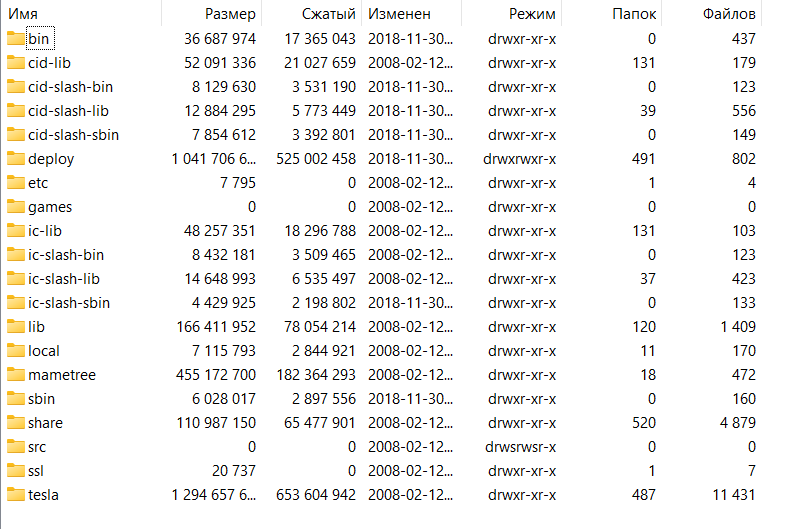

### Система навигации Valhalla:
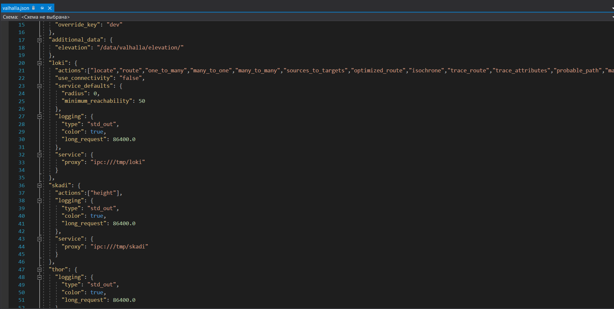

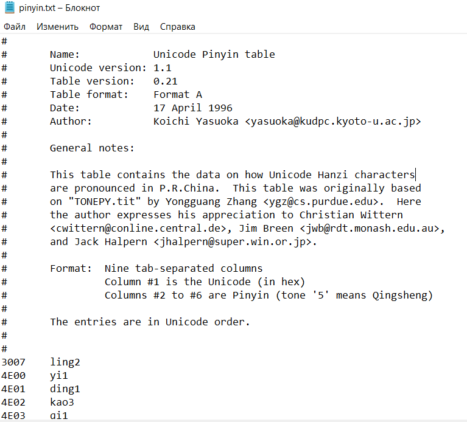

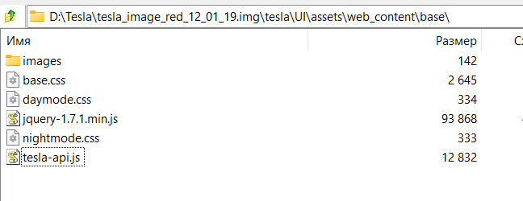

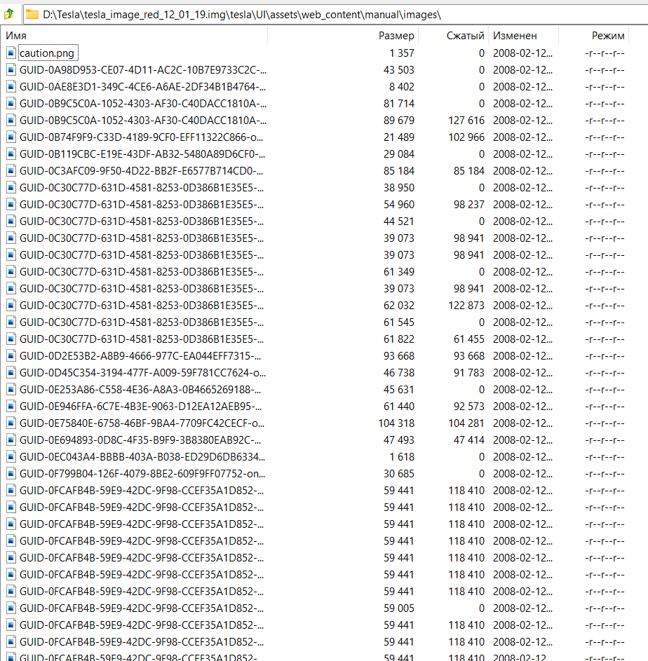

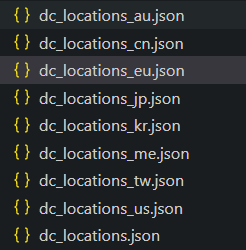

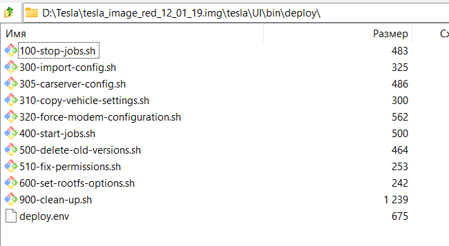

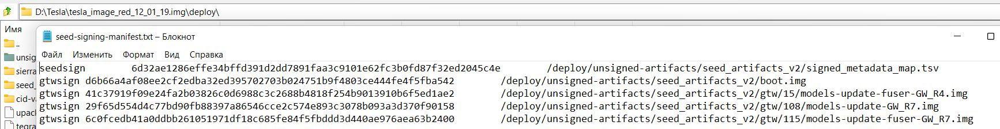

### В папке share\base-files\ нашли ip-шник

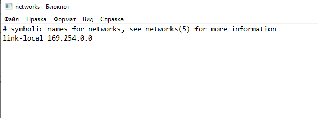

### Файл с локализацией, в котором было найдено что-то похожее на почту:

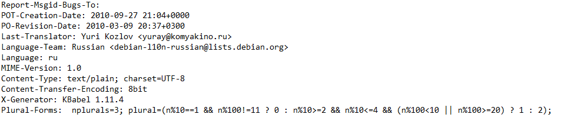

### Папка с системными скриптами:

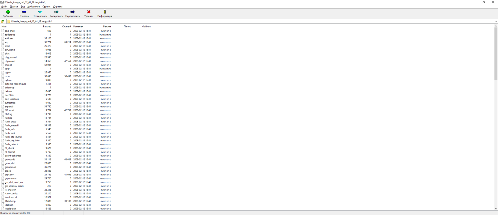

### Настройки подключения к openvpn   

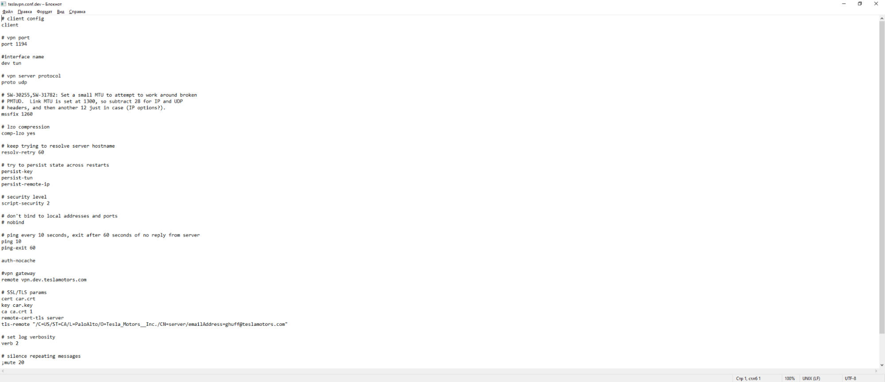

### Руководство пользователя

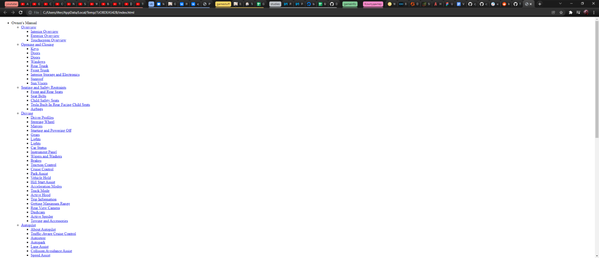

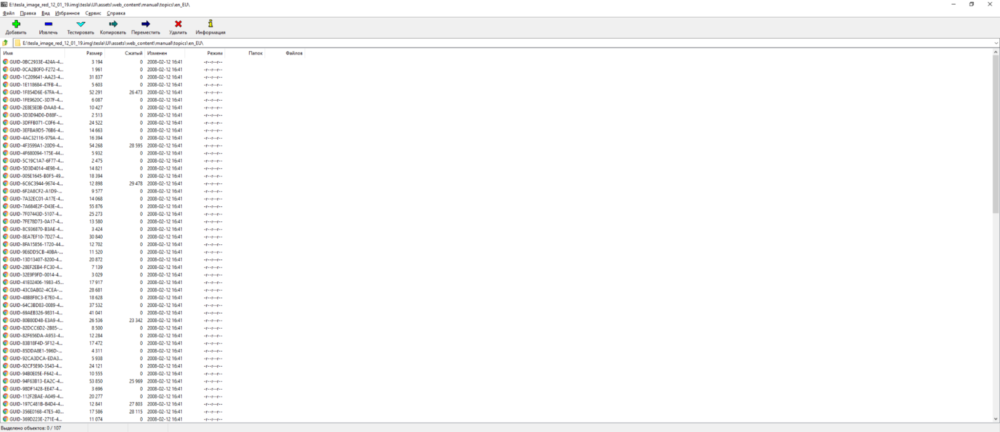

### Так же было найдено много файлов-ассетов для ИИ

### Также мы нашли другой способ открыть файл, используя PowerISO. Благодаря этому нам открылись недоступные до этого файлы, полный список директорий которых можно увидеть ниже:

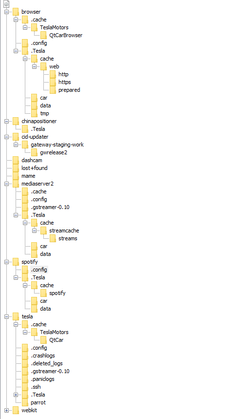

### Среди интересных файлов есть папка spotify, в ней файл trolltech из которого мы узнаём, что в системе используется sqlite.
### По пути Tesla>browser>.Tesla>cache>web>https располагаются файлы формата .cache, большинство из которых нечитаемы, а остальные имеют бесполезную информацию, например хранят css стили 

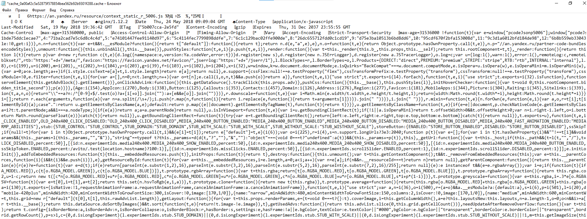

### В этой папке хранится весь кэш открываемых сайтов, поэтому вся папка cache не представляет для нас ценности.
### chinapositioner не несёт в себе никаких полезных файлов, а cid-updater почти полностью состоит из внутренних файлов, которые тоже не представляют интереса

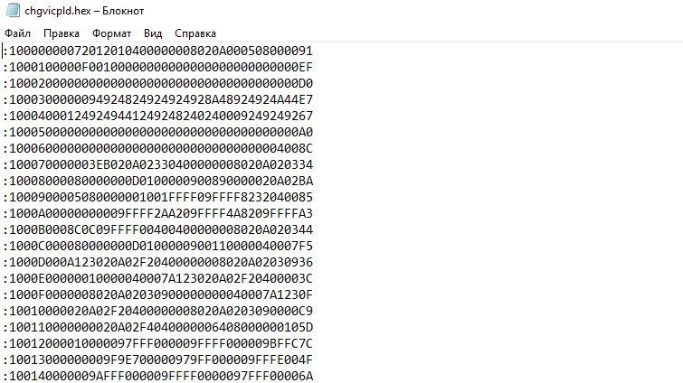

### В последовательности Tesla>webkit>cache>Version 11 нашли файл с названием salt без расширения. Видимо для хэширования

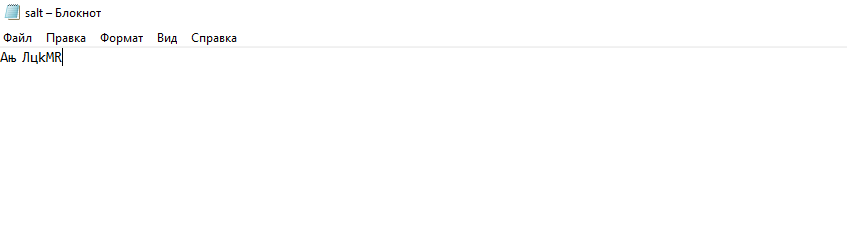

### В папке Tesla>tesla>.crashlogs лежат логи 

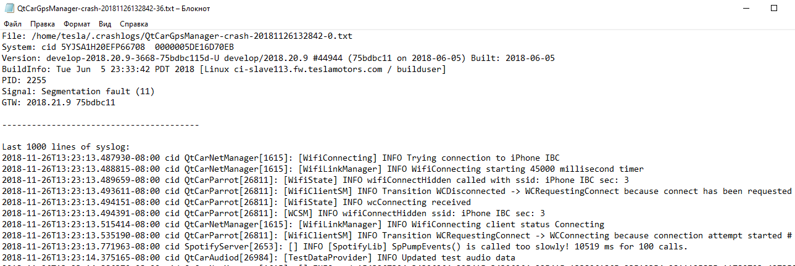

### В них есть ссылки на публичный ip с разными портами (например 224.0.0.26:4501)

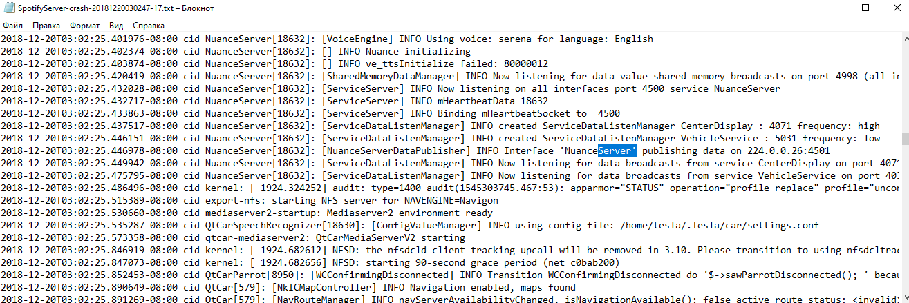

### И ещё 10.224.19.*
### Копаясь в файле NuanceServer нашли тот же ip и подпись к нему - [mothership.vn.teslamotors.com]. Покопавшись в интернете нашли интересную статью о том, что этот сервис является внутренним и отвечает за передачу команд на автомобили клиентов.

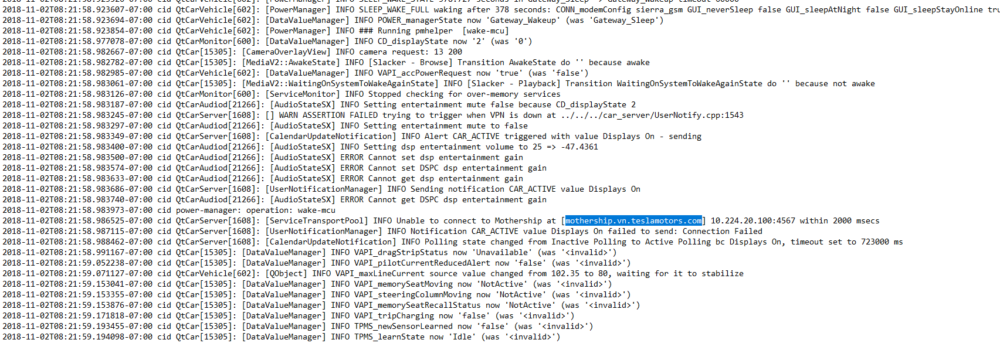

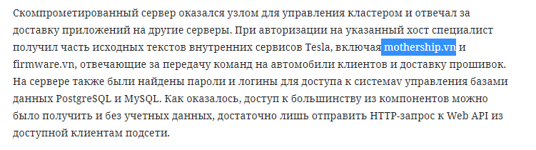

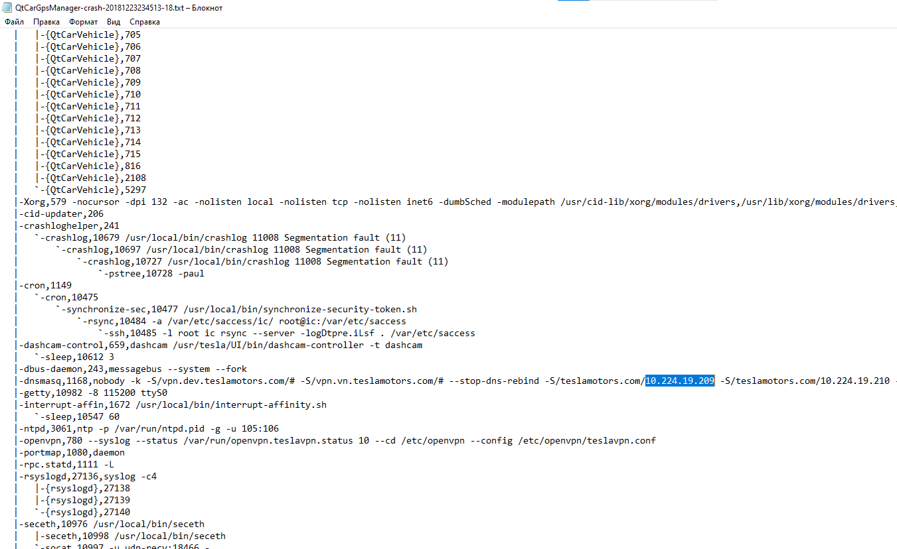

### В пути Tesla>tesla>.ssh найден файл authorized_keys содержащий ssh ключи

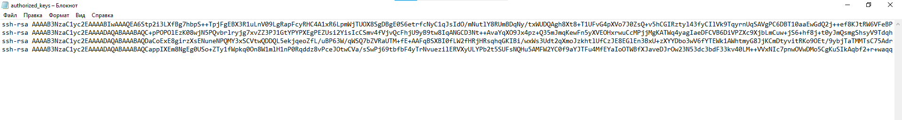

### В пути Tesla>tesla>.Tesla>data>media найден файл AuthTokens с, очевидно, устаревшими токенами

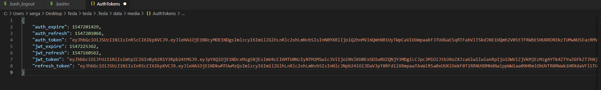

### В пути Tesla>tesla>.Tesla был найден файл service_contact_info.json содержащий номера контактных телефонов сервисов TelsaMotors

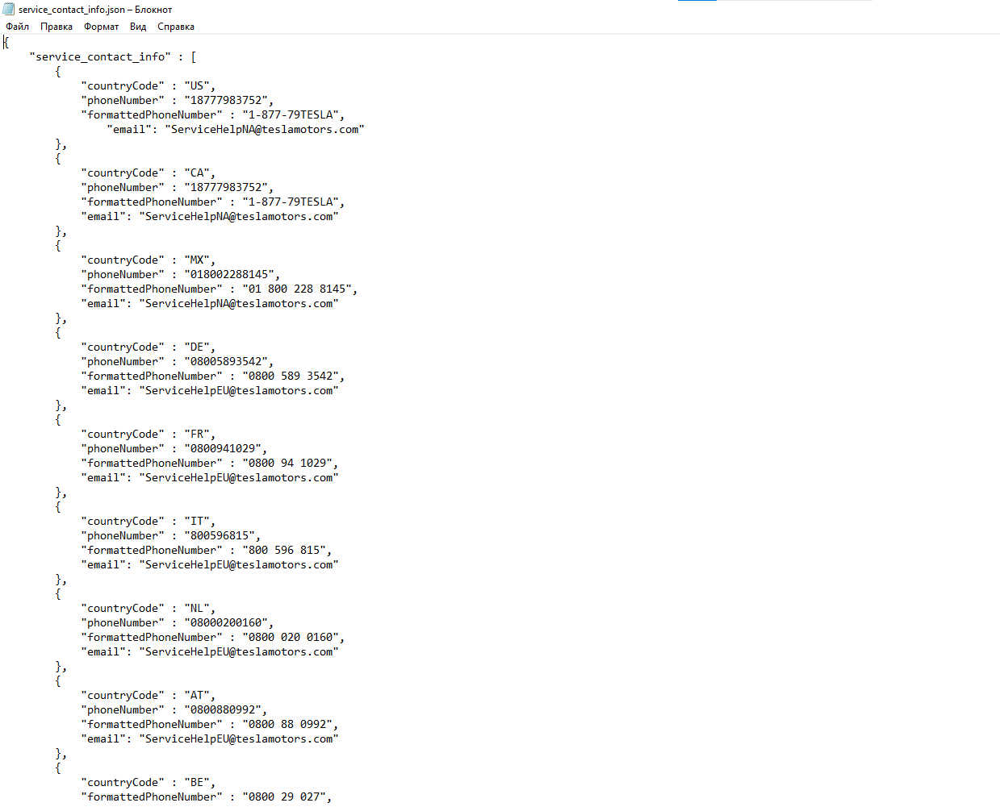

### В пути Tesla>tesla>.Tesla>tmp был найден архив, содержащий перевёрнутые снимки, сделанные, по всей видимости, машиной Tesla. По ним вполне можно определить, откуда они были сделаны.

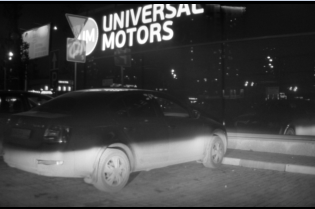

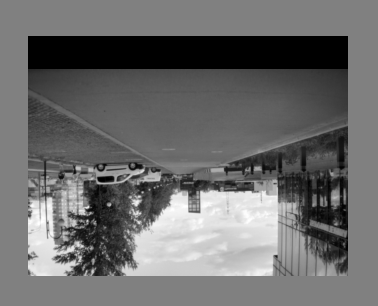

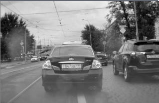

### Судя по обработанным снимкам (перевернули и отразили по горизонтали) снимки были сделаны в Москве, а конкретно первый был сделан на Ленинградском шоссе 47

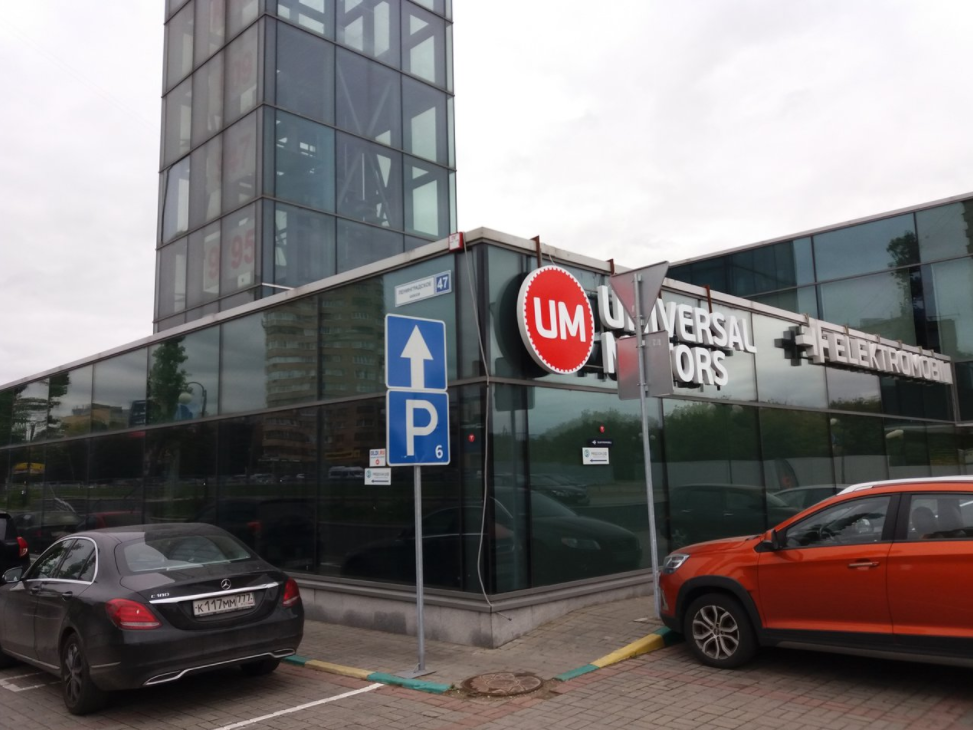
